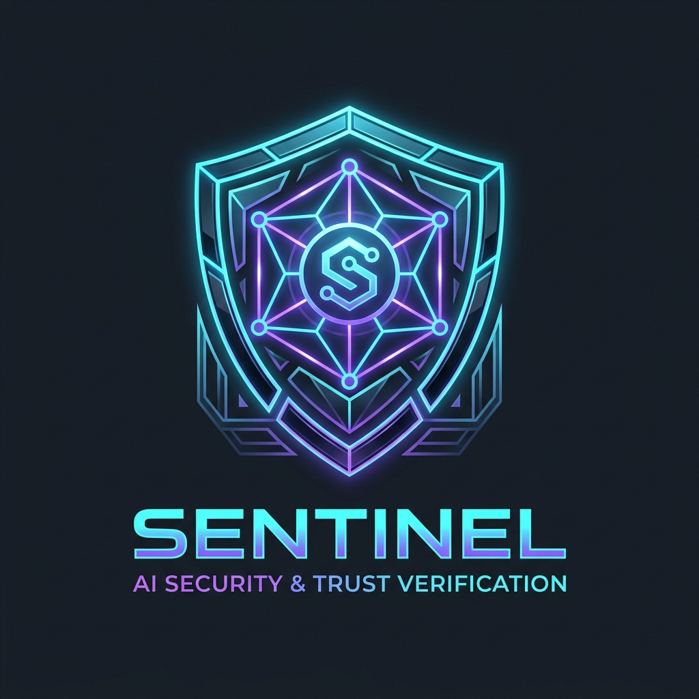

<p align="center">
  
</p>

# Sentinel Trust Layer

## The Verification Layer For Autonomous Agents

AI agents are moving from recommendations to execution. They are no longer just suggesting actions — they are signing transactions, moving assets, interacting with contracts, and making decisions on behalf of users and organizations.

But one problem remains:

> **How do we know an autonomous decision should be trusted before it happens?**

Sentinel provides the trust infrastructure between autonomous intelligence and real-world execution. It verifies agent actions, evaluates risk, creates cryptographic decision records, and provides accountability for every important action.

**Built for the OKX.AI Genesis Hackathon & Stablecoin Commerce Stack Challenge.**

---

## 🌟 Overview

Traditional systems answer:
> *"What happened?"*

Sentinel answers:
> *"Should this have happened?"*

Before an autonomous action is executed, Sentinel evaluates:
- **Agent Identity**: Authorization and permission scope
- **Action Intent**: Semantic intent and T1–T8 threat taxonomy check
- **Policy Compliance**: Spending limits and restriction rules
- **Risk Exposure**: Payload anomalies and destination safety
- **Execution Context**: Workflow state (`task_spec`, `negotiation`, `deliverable`, `settlement`)

The result is a verifiable **Trust Receipt** — a permanent record explaining what was checked, why the decision was made, and what happened next.

---

## 🛠️ Monorepo Structure

```text
sentinel/
├── apps/
│   ├── api/          # Hono API service (Node 20 / TypeScript)
│   └── web/          # React + Vite Developer UI & Sandbox Suite (6 Pages)
├── packages/
│   ├── sdk/          # @sentinel/sdk (NPM Package for agent developers)
│   └── rules/        # Sub-18ms Stage 1 Deterministic Rules Library
└── contracts/        # SentinelBond.sol (Foundry / Solidity on X Layer)
```

---

## 🛡️ Why Sentinel Exists

Autonomous systems create a new challenge. A human can explain: *"I made this decision because..."* An AI agent cannot rely on trust alone.

As agents gain access to digital assets, smart contracts, enterprise systems, and financial infrastructure, they need a verification layer that provides:
- **Transparency**: Clear rationale for every cleared or blocked action
- **Accountability**: Ed25519 signed receipts verifiable client-side
- **Auditability**: Tamper-evident Trust Chains linking job history
- **Controlled Execution**: 1-line pre-settlement verification

---

## 📐 Architecture Flowchart

```text
             Autonomous Agent
                    │
            Action Submitted
                    │
          Sentinel Trust Layer
    ┌───────────────┼───────────────┐
    │               │               │
Identity Check  Intent Analysis  Policy & Risk
    │               │               │
    └───────────────┼───────────────┘
                    │
              Trust Decision
                    │
      ┌─────────────┴─────────────┐
   APPROVED                    REJECTED
      │                           │
  Execution                   Review / Escrow Lock
      │                           │
  Trust Receipt Created       Dispute Hub Review
```

---

## 🚀 Core Components & Dashboard Suite

1. **Decision Scanner (`/scanner`)**:
   - Evaluates agent actions before execution against Stage 0–3 security layers.
2. **Trust Chain (`/chain`)**:
   - Hashes receipts linearly (`prev_receipt_hash`) to form an immutable decision trail for `job_id`.
3. **Trust Receipts (`/receipts`)**:
   - Ed25519 signed, portable JSON records containing content hashes, risk scores, and verification checks.
4. **Receipt Verification (`/verifier`)**:
   - Client-side verification of receipts using Sentinel's published Ed25519 public key without database lookups.
5. **Dispute Hub (`/disputes`)**:
   - Recourse mechanism backed by an on-chain **50,000 OKB** escrow bond on X Layer with 10× refund slashing guarantees.
6. **Analytics & Threat Intel (`/analytics`)**:
   - Telemetry dashboard tracking agent reputation scores, policy friction, and decision performance.

---

## 💻 Integration Example

Integrate Sentinel into your agent execution loop in **4 lines of code**:

```typescript
import { Sentinel } from "@sentinel/sdk";

const sentinel = new Sentinel({ apiKey: "sentinel_live_key" });

const decision = await sentinel.verify({
  agent: "payment-agent-01",
  action: {
    type: "transfer",
    amount: "250 USDC",
    destination: "0x84222290DD7278Aa3Ddd389Cc1E1d165CC4BAfe5"
  },
  context: "Supplier payment"
});

if (decision.approved) {
  await executeTransaction();
}
```

### API Response Shape

```json
{
  "decision": "APPROVED",
  "riskScore": 12,
  "confidence": 0.98,
  "receipt": "SL-8F92A1",
  "checks": {
    "identity": true,
    "intent": true,
    "policy": true,
    "risk": true
  },
  "trust_receipt": {
    "verdict_hash": "0x7f8291a2b91c4e5d6f7890123456789abcdef",
    "signature": "ed25519_sig_8f92a1..."
  }
}
```

---

## 🗺️ Roadmap Overview

* **Phase 1 — Trust Foundation & Hackathon Core (Shipped)**: 4-Stage Security Pipeline, Ed25519 Signed Receipts, Trust Chains, X Layer Escrow Bond, 6-Page UI Suite.
* **Phase 2 — Autonomous Accountability (Q3 2026)**: Stage 4 Retrospection Engine, Decentralized Arbitration Protocol, LangChain/AutoGPT SDK Middleware.
* **Phase 3 — Enterprise & Autonomous Network (Q4 2026)**: Cross-Chain Receipt Verification (Solana, EVM, Cosmos), Zero-Knowledge Confidential Proofs.

👉 **View the full development roadmap in [ROADMAP.md](ROADMAP.md).**

---

## 🛠️ Local Development

### Requirements
- Node.js >= 20
- npm
- Git

### Installation
```bash
git clone https://github.com/Olalolo22/Sentinel.git
cd Sentinel
npm install
```

### Run Web Application & API
```bash
# Build the rules package
npm run build -w packages/rules

# Start API backend
npm run dev -w apps/api

# Start Web Frontend
npm run dev -w apps/web
```

---

## 🔒 Security & License

- **Signing Key**: Ed25519 Native (`crypto.sign`)
- **Bond Contract**: `contracts/SentinelBond.sol` on X Layer
- **License**: MIT

*Autonomous systems will make decisions. Sentinel makes those decisions verifiable.*
